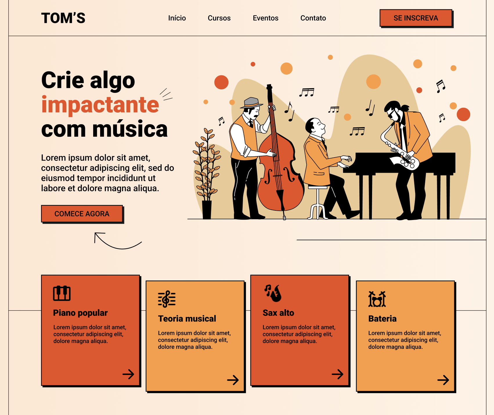

  

## 🚀 Tecnologias

Esse projeto foi desenvolvido com as seguintes tecnologias:

- HTML
- CSS
- JavaScript

## ⌨️ Conceitos:

- Mobile-First
- Responsividade
- HTML semântico
- Flexbox
- Grid

## 💻 Projeto:

Landing page desenvolvida para uma escola de música.

## 🎨 Design:

Figma: https://www.figma.com/file/76GJ4uK7PyKeAo6dcpVyjA/Tom's-Jazz-School?node-id=23%3A4327&t=LfIz6EcYjUOWgf5N-0

---

Feito por Bruno Rodrigues feat. <a href="https://www.youtube.com/watch?v=Wo7UnH8TYbc">One Bit Code</a>
